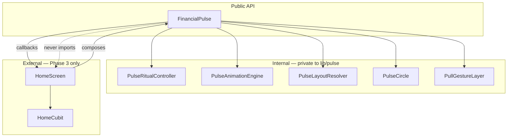

# Financial Pulse — Component Architecture

**Status:** Proposed for lock (Phase 1) · **Direction:** Home Experience v4 (PD-027)

This document defines how the Financial Check-In is decomposed so Home can evolve without rewriting the ritual. The Pulse **emits events**. Home **listens**. Animation drives the interface — never the reverse.

---

## Design Principles

1. **FinancialPulse is a reusable package boundary** — no Home imports, no business logic, no data fetching.
2. **Animation ownership is centralized** — one engine, one state machine, one public widget.
3. **Home composes around Pulse** — composition, not inheritance or tight coupling.
4. **Iterate inside `lib/pulse/`** — polish the ritual for days without touching Home.

---

## Component Map



---

## 1. FinancialPulse

| | |
|---|---|
| **Purpose** | Public entry point. Product-defining Check-In ritual in one composable widget. |
| **Responsibilities** | Compose internal layers; wire callbacks; render greeting + circle; optional `child` slot for content below chrome (Phase 3). |
| **Public API** | See below. |
| **Animation ownership** | None directly — delegates to `PulseAnimationEngine`. |
| **State ownership** | Owns `PulseRitualController` instance; syncs engine to controller phase. |
| **Communication** | Emits callbacks upward. Never calls Home. Never reads financial data. |

### Public API (locked for Phase 2)

```dart
FinancialPulse({
  required String greeting,
  required PulseState pulseState,
  bool showHeroPresentation = true,
  VoidCallback? onPresentationSettled,   // hero → header complete
  VoidCallback? onCheckInStarted,        // pull began
  VoidCallback? onThresholdReached,      // pull threshold met
  Future<void> Function()? onResolveBeat, // Check-In fetch — awaited after heartbeat
  VoidCallback? onHeartbeatFinished,
  VoidCallback? onReturnedHome,
  ValueChanged<double>? onPullProgress,  // 0.0–1.0 — content shift (Phase 3)
  Widget? child,                         // slot below chrome (Phase 3 / demo)
  Color? backgroundColor,
})
```

### Callback contract

| Callback | Fires when | Home reaction (Phase 3) |
|---|---|---|
| `onPresentationSettled` | Hero presentation settled into header (~1s) | Enable Check-In; content may shift up |
| `onCheckInStarted` | Member begins pull | No-op — `onPullProgress` shifts content only |
| `onThresholdReached` | Pull crosses threshold | Start Check-In request (`onResolveBeat`); Pulse moves to center |
| `onResolveBeat` | At threshold | Home fetches Check-In response; awaited after heartbeat before return |
| `onHeartbeatFinished` | Heartbeat + resolve complete | Reveal result on HavenHeroCard; clear transient state |
| `onReturnedHome` | Greeting + Pulse back in header | Clear transient state |
| `onPullProgress` | Continuous during pull | Shift `child` downward |

---

## 2. PulseRitualController

| | |
|---|---|
| **Purpose** | Pure ritual state machine. Testable without Flutter. |
| **Responsibilities** | Phase transitions; pull offset/progress; validate legal transitions; fire one-shot event flags. |
| **Public API** | `phase`, `pullProgress`, `beginPull()`, `updatePull()`, `endPull()`, `markHeartbeatComplete()`, etc. |
| **Animation ownership** | None — logic only. |
| **State ownership** | Owns ritual phase + pull metrics. |
| **Communication** | Read by `FinancialPulse` state; never talks to widgets directly. |

### Phases

```
heroPresentation → settlingToHeader → headerRest
headerRest → checkInPull → heartbeat → returningToHeader → headerRest
```

---

## 3. PulseAnimationEngine

| | |
|---|---|
| **Purpose** | Owns all `AnimationController`s and tick listeners. |
| **Responsibilities** | Passive breath; hero→header settle; heartbeat; return-to-header; haptic triggers at phase boundaries. |
| **Public API** | `breath`, `heroSettle`, `heartbeat`, `returnHome` values (0–1); `startHeroSettle()`, `startHeartbeat()`, `startReturn()`, `dispose()`. |
| **Animation ownership** | **Full ownership** of all motion curves and durations. |
| **State ownership** | None — driven by controller phase. |
| **Communication** | `FinancialPulse` listens to animation status → updates controller → fires callbacks. |

---

## 4. PulseLayoutResolver

| | |
|---|---|
| **Purpose** | Maps `(phase, animation values, pullProgress)` → layout frame for greeting + circle. |
| **Responsibilities** | Hero layout; header row layout; Check-In layout (greeting left, circle beneath); interpolation. |
| **Public API** | `PulseLayoutFrame resolve(PulseLayoutInput input)` |
| **Animation ownership** | None — reads animation values, outputs geometry. |
| **State ownership** | None — pure function. |
| **Communication** | Called each frame by `FinancialPulse` build. |

### PulseLayoutFrame

```dart
class PulseLayoutFrame {
  final Offset greetingPosition;
  final double greetingFontSize;
  final Offset pulseCenter;
  final double pulseDiameter;
  final double pulseScale;
  final double pulseGlow;
  final double chromeHeight;
  final double contentShift; // downward shift for child slot
}
```

---

## 5. PulseCircle

| | |
|---|---|
| **Purpose** | Renders the circular Pulse — PD-026 locked form. |
| **Responsibilities** | Multi-layer glow; circle fill; scale transform applied by parent. |
| **Public API** | `PulseCircle({required Color color, required double diameter, required double glowOpacity, double scale = 1})` |
| **Animation ownership** | None — displays values passed in. |
| **State ownership** | None — stateless. |
| **Communication** | Parent positions via `PulseLayoutResolver`. |

---

## 6. PullGestureLayer

| | |
|---|---|
| **Purpose** | Detect Check-In pull when in `headerRest`. |
| **Responsibilities** | Vertical drag; forward delta to controller; ignore when not in headerRest or scroll not at top. |
| **Public API** | Inline `Listener` + `NotificationListener<ScrollNotification>` in `FinancialPulse` |
| **Animation ownership** | None. |
| **State ownership** | None. |
| **Communication** | Calls `PulseRitualController` methods via `FinancialPulse` coordinator. |

---

## Dependency Rules

| Rule | Rationale |
|---|---|
| `lib/pulse/` never imports `lib/features/home/` | Package boundary |
| Home never drives Pulse animation controllers | Animation drives interface |
| Home never passes financial data into Pulse | Pulse is ritual-only |
| Pulse never calls HomeCubit | Events only |
| `PulseRitualController` has zero Flutter imports | Unit-testable state machine |

---

## Phase Rollout

| Phase | Scope |
|---|---|
| **1** | This architecture document — locked (PD-028) |
| **2** | `FinancialPulse` + demo screen |
| **3** | Home composes `FinancialPulse`; Cubit listens to callbacks — **complete (PD-029)** |
| **4** | Polish pass — typography, timing, restraint — no new features |

### Scroll integration (Phase 3)

- `child` slot wrapped in `Expanded` — Home passes a scrollable `ListView`.
- `NotificationListener<ScrollNotification>` tracks scroll-at-top; Check-In pull engages only when at top (or during active pull).
- `contentShift` up to 52px (`HavenMotion.pulseContentShiftMax`) during pull/heartbeat/return.

---

## File Layout (Phase 2)

```
lib/pulse/
├── financial_pulse.dart              # Public widget
├── pulse_exports.dart                # Barrel
├── controller/pulse_ritual_controller.dart
├── animation/pulse_animation_engine.dart
├── layout/pulse_layout_resolver.dart
├── visual/pulse_circle.dart
├── pulse_ritual_phase.dart
├── pulse_colors.dart
└── demo/financial_pulse_demo_screen.dart
```

**Removed (v3 superseded):** `financial_pulse_ritual.dart`, `pulse_glyph_painter.dart`, `pulse_orchestration.dart`

---

## Related

- [HAVEN_FINANCIAL_PULSE.md](HAVEN_FINANCIAL_PULSE.md) — product spec
- [HAVEN_ARCHITECTURE.md](HAVEN_ARCHITECTURE.md) — app architecture
- [HDL/20-components.md](HDL/20-components.md) — component spec
