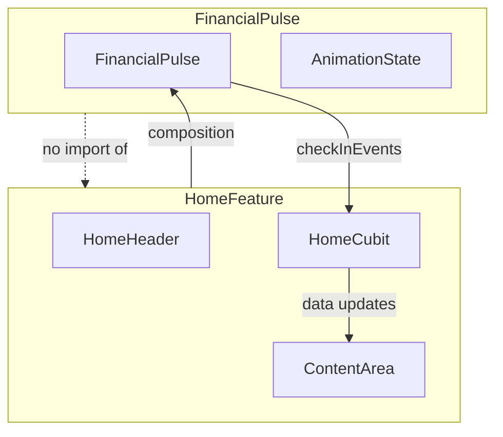

# Haven Architecture

Engineering structure for Haven. Product soul: [HAVEN_MANIFESTO.md](HAVEN_MANIFESTO.md). Home experience: [HAVEN_HOME_EXPERIENCE.md](HAVEN_HOME_EXPERIENCE.md).

**Current direction:** Home Experience v4 (PD-027). See [HAVEN_FINANCIAL_PULSE.md](HAVEN_FINANCIAL_PULSE.md).

---

## Principles

1. **Product-defining systems are independent.** `FinancialPulse` owns its animation lifecycle. Home orchestrates around it.
2. **Build first, standardize after validation.** HDL tokens follow proven prototypes ([HDL.md](HDL.md)).
3. **Features are vertical slices.** Home, Money, Plans under `lib/features/`.
4. **Premium through restraint.** v4 deliberately simplifies v3 — no particles, no hidden content, no abstract glyphs.

---

## Application Structure

```
lib/
├── main.dart
├── theme/                    # Design tokens
├── pulse/                    # FinancialPulse system (v3 code — refactor to v4)
├── widgets/                  # Shared components
└── features/
    ├── home/                 # Home orchestrates around FinancialPulse
    └── shell/                # Bottom navigation
```

---

## FinancialPulse — Independent Component

**Product spec:** [HAVEN_FINANCIAL_PULSE.md](HAVEN_FINANCIAL_PULSE.md)
**Component architecture:** [FINANCIAL_PULSE_ARCHITECTURE.md](FINANCIAL_PULSE_ARCHITECTURE.md) (PD-028, Locked)
**Component spec:** [HDL/20-components.md](HDL/20-components.md)
**Component spec:** [HDL/20-components.md](HDL/20-components.md)

### Responsibilities (v4)

| Responsibility | Description |
|---|---|
| Passive breathing | ~20–24px circle in header; imperceptible breath |
| Expanded presentation | First-launch hero layout with greeting + Pulse |
| Header transition | Greeting + Pulse settle into header together (~1s) |
| Check-In pull | Pulse grows + travels to center with pull; content shifts down |
| Heartbeat | Double beat at center; HavenHeroCard reading begins at destination |
| Return to header | Pulse returns from center to header — no particles |
| Animation state | Internal state machine — Home does not drive frames |

### Does not own

- Home data fetching (`HomeService` / `HomeCubit`)
- Emotional copy, amounts, guidance text
- Bottom navigation

### Dependency direction



**Rule:** `FinancialPulse` must not import Home widgets or cubits. Exposes callbacks. Home subscribes.

### Orchestration events (contract)

| Event | Home reaction |
|---|---|
| `presentationPhase(phase)` | First-launch expanded → header settle |
| `pullProgress(double)` | Shift content downward; optional subtle background |
| `heartbeatProgress(double)` | Update emotional status, money, guidance, activity |
| `checkInComplete()` | Silent data refresh if needed |
| `ritualIdle()` | Header rest state restored |

HomeCubit holds **content** state. FinancialPulse holds **animation** state.

---

## Home Screen Composition (v4)

```
Scaffold
├── FinancialPulse (owns greeting + pulse rendering)
│   ├── Phase: FirstLaunchExpanded | HeaderRest | CheckInPull | Heartbeat | Returning
│   └── HomeHeader anchor (greeting left, circle right)
├── Content (always visible after first launch settle)
│   ├── EmotionalStatus
│   ├── MoneyEvidence
│   ├── HavenGuidance
│   └── ActivityContext
└── HavenBottomNav
```

Content is **never hidden** after first-launch presentation settles. During Check-In, content shifts down — it does not fade away.

---

## Implementation Status

| Artifact | Status | Notes |
|---|---|---|
| v4 documentation | Current source of truth | This release |
| `lib/pulse/` (v3) | **Superseded** | Abstract glyph, glyph-only detach, particle return, hidden content — refactor required |
| `lib/widgets/pulse_orb.dart` | Reusable | Circular form aligns with PD-026; integrate into FinancialPulse |
| `PulseRecognition` (v2) | Removed | Superseded |

### v4 refactor checklist (when implementing)

- [ ] Replace abstract `PulseGlyphPainter` with circular Pulse
- [x] Pull shifts content only — header chrome fixed until beat threshold (PD-030)
- [x] Pulse beats at screen center, returns to header (PD-030)
- [ ] Remove particle return animation
- [ ] Content always visible; shift on pull instead of hide/reveal
- [ ] Add first-launch expanded presentation + header settle
- [ ] Rename `FinancialPulseRitual` → `FinancialPulse` per component spec

---

## State Management

| Layer | Owns |
|---|---|
| FinancialPulse | Animation phases, pull, heartbeat, header transition |
| HomeCubit | HomeData, content update flags, session state |
| App shell | Tab selection |

Do not drive Pulse animation from HomeCubit rebuilds.

---

## Related

- [HAVEN_FINANCIAL_PULSE.md](HAVEN_FINANCIAL_PULSE.md) — Check-In specification
- [HAVEN_HOME_EXPERIENCE.md](HAVEN_HOME_EXPERIENCE.md) — Home emotional spec
- [HDL/20-components.md](HDL/20-components.md) — FinancialPulse component
- [PRODUCT_DECISIONS.md](PRODUCT_DECISIONS.md) — PD-026, PD-027
