# Haven Financial Pulse

The Financial Pulse is Haven's signature interaction — a product-defining system, not a decorative widget.

Its form is a **simple circle** (PD-026, Locked). Its recognizability comes from **behaviour, ritual, and emotional design** — not from complex iconography.

**Home Experience v4** — this document is the source of truth for Check-In interaction.

---

## Product Philosophy

Members do not open Haven to refresh data.

Members open Haven to **check in** with their financial wellbeing.

The interaction answers one question: **"How am I doing?"**

### Language rules

| Use | Never use |
|---|---|
| Check-In / Financial Check-In | Refresh |
| Check in with your Pulse | Pull to refresh |
| Financial wellbeing | Update data, sync |
| The heartbeat is the check-in | Loading, syncing |
| Reading your Pulse | Updating, fetching |

**"Pulse" is product identity** — a verb and a noun. Members do not refresh; they **Pulse**. The word belongs to the ritual, not to generic loading states.

---

## Form — Circular Pulse (Locked)

Return to the **circle**. Timeless, calm, neutral.

Identity comes from **motion**, not shape.

### Do not use as the Pulse glyph (PD-026)

Hearts · ECG lines as logo/icon · Blobs · Seeds · Droplets · Compass icons · Abstract glyphs · Logo marks

The **header circle** stays the permanent Financial Pulse form. Identity comes from **behaviour**, not from replacing the circle with medical iconography.

### Pulse Line — Check-In reading (PD-030)

During Check-In, the **HavenHeroCard** shows a **Pulse Line** — a calm, hospital-monitor-style ECG sweep. This is the **reading ritual**, not the header glyph.

| Attribute | Rule |
|---|---|
| Purpose | Communicate "Haven is reading your financial wellbeing" |
| Style | Single calm line sweep — restrained, not clinical alarm |
| Color | Current `PulseState` accent — never red alarm aesthetics |
| Duration | Runs through the Check-In; may hold calmly if the response is slow |
| Reveal | **Results appear only after the Pulse Line completes and the response arrives** |

**Do not use during Check-In:** random number scrambling, slot-machine digits, fake cycling status labels, spinners, progress bars.

---

## Home Header — Resting State

```
Good morning, Omar                     ○
```

- Greeting left-aligned.
- Circular Pulse right — ~20–24px.
- Almost imperceptible breathing every few seconds.
- Alive but never distracting. **No heartbeat while idle.**

---

## First Launch Presentation

When entering Home:

1. Greeting and Pulse appear in **expanded presentation** with full content visible below.
2. Screen feels welcoming — not empty, not gratuitously animated.
3. After ~1 second: Greeting and Pulse transition **together** into the Home Header.
4. Content below shifts upward. Nothing disappears. Nothing fades away.

This teaches the member where Greeting and Pulse live.

**Trigger:** entering Home only — not after every Check-In.

---

## Check-In Interaction Specification

### State machine

```mermaid
stateDiagram-v2
  direction LR
  headerRest: HeaderRest
  firstLaunch: FirstLaunchPresentation
  pulling: CheckInPull
  heartbeat: Heartbeat
  pulseReading: PulseReading
  reveal: RevealResult
  returning: ReturnToHeader
  firstLaunch --> headerRest: settleAfterOneSecond
  headerRest --> pulling: memberPullsDown
  pulling --> heartbeat: thresholdReached
  heartbeat --> pulseReading: circleBeatComplete
  pulseReading --> reveal: lineCompleteAndResponseReady
  reveal --> returning: resultShown
  returning --> headerRest: greetingAndPulseHome
```



| Phase | Member experience |
|---|---|
| **First launch presentation** | Expanded greeting + Pulse with full content. Warm welcome. |
| **Header rest** | Greeting + small breathing Pulse in fixed header. Content visible below. |
| **Check-In pull** | Pulse grows and travels toward **screen center** with the pull; content shifts down; hero card unchanged. |
| **Heartbeat** | Pulse at center — calm double beat. HavenHeroCard enters reading only now. |
| **Pulse reading** | HavenHeroCard shows a **Pulse Line** (ECG sweep). Previous wellbeing content dims — not replaced with fake data. |
| **Reveal** | Emotional status + Safe to Spend appear from the reading — real response only. |
| **Return** | Greeting and Pulse return **together** to header. Simple. Ends where it began. |

### Check-In pull (detailed)

When the member pulls downward:

1. **Pulse is pulled with the gesture** — grows larger and travels from the header toward **screen center**, as if the member is drawing it down.
2. Greeting stays in the header; only the Pulse moves and scales.
3. Content below (including HavenHeroCard) **shifts downward only** — no loading, no Pulse Line, no visual change.
4. At **destination** (pull threshold, Pulse at center): double beat begins; HavenHeroCard enters Pulse reading mode.

This is **not** pull-to-refresh. No spinners, progress bars, rotation icons, or refresh copy.

### Heartbeat + Pulse reading

At pull threshold:

1. **Header circle** — travels from header to **screen center**, then calm double beat (expand → contract → expand → contract → settle). Subtle haptic at each peak.
2. **HavenHeroCard** — transitions into **Pulse reading** mode: a hospital-monitor-style **Pulse Line** sweeps across the card.
3. **Check-In request** starts at threshold — runs in parallel with the animation.
4. **Hold** — if the response is slower than the line, the line holds calmly at the end (no frantic looping, no fake numbers).
5. **Reveal** — when the Pulse Line completes **and** the response is ready, show the real result:
   - Emotional status (from `PulseState`: calm · strong · attention)
   - Safe to Spend (if changed)
   - Recommendation and activity may refresh quietly after

The Pulse Line **is** the wait. No spinner. No scrambled digits. No pretend status cycling.

### Return

- Greeting and Pulse return **together** to the Home Header.
- **No particles. No magical effects. No flying objects.**
- Premium through restraint. Animation ends exactly where it began.

---

## Component: FinancialPulse

Dedicated component owning:

| Responsibility | Owner |
|---|---|
| Passive breathing | FinancialPulse |
| Expanded first-launch presentation | FinancialPulse |
| Check-In circle heartbeat | FinancialPulse |
| Haptic feedback | FinancialPulse |
| Hero ↔ Header transition | FinancialPulse |
| Animation state | FinancialPulse |
| Pulse Line reading animation | HavenHeroCard (Home) |
| Check-In response + reveal | HomeCubit / HomeService |

Home **orchestrates around** FinancialPulse. FinancialPulse does **not** depend on Home layout.

Specification: [HDL/20-components.md](HDL/20-components.md) · Architecture: [HAVEN_ARCHITECTURE.md](HAVEN_ARCHITECTURE.md)

---

## Motion Principles

Calm · Purposeful · Organic · Premium · Human

Avoid: playful animation, elastic exaggeration, bouncy effects, overly decorative transitions.

Use restrained spring animations. The member remembers the **feeling**, not the animation.

Details: [HDL/12-motion.md](HDL/12-motion.md)

---

## Success Criteria

### Ideal journey

Open Haven → Feel welcomed → Understand wellbeing → Optionally Check-In → Receive reassurance → Continue with confidence.

### Succeeds

> "I like checking in."

### Fails

> "Pull to refresh."

---

## Removed from direction (v3 and earlier)

The following are **intentionally rejected** in v4:

- Abstract pulse glyphs (pebble, capsule, blob)
- Particle return animations
- Disappearing or hidden Home content before Check-In
- Decorative visual effects (flying objects, magical compression)
- Discoverability drift cues (experimental v3)
- Glyph-only detach (greeting must move with Pulse)

---

## Open Questions

| Question | Status |
|---|---|
| **Expanded presentation layout** | Open — spacing validation |
| **First-launch trigger** | Open — install vs session |
| **Check-In without pull** | Open — accessibility fallback |
| **Heartbeat during data latency** | **Resolved (PD-030)** — Pulse Line holds calmly until response; no fake data |
| **Attention (amber) state** | Open — same flow vs extended listen |

---

## Related

- [HAVEN_HOME_EXPERIENCE.md](HAVEN_HOME_EXPERIENCE.md) — Home screen spec
- [HAVEN_ARCHITECTURE.md](HAVEN_ARCHITECTURE.md) — engineering architecture
- [HDL/13-financial-pulse.md](HDL/13-financial-pulse.md) — visual specification
- [HDL/20-components.md](HDL/20-components.md) — component API
- [PRODUCT_DECISIONS.md](PRODUCT_DECISIONS.md) — PD-026, PD-027, PD-030
