# HDL 13 — Financial Pulse

**Status:** LOCKED (form — PD-026) · EXPERIMENTAL (Check-In motion — PD-027, PD-030)

**Implementation:** [`lib/pulse/`](../lib/pulse/) · [`lib/features/home/widgets/pulse_line.dart`](../lib/features/home/widgets/pulse_line.dart)

---

## Purpose

The definitive specification for Haven's Financial Pulse — the signature Check-In ritual.

This document covers visual identity, states, motion, timing, springs, haptics, interaction, component boundaries, and implementation rules. An engineer should be able to implement Pulse from this document alone.

Pulse **emits events**. Home **listens**. Animation drives the interface — never the reverse (PD-028).

---

## Principles

- The Pulse is **wellbeing**, not a score (PD-003).
- Form is a **simple circle** — identity comes from motion and ritual, not iconography (PD-026).
- Members do not refresh data; they **Check-In** with their Pulse.
- The **heartbeat is the Check-In** — not a loading spinner.
- The **Pulse Line is the wait** during reading — not scrambled digits or progress bars (PD-030).
- Premium through **restraint**: no particles, no elastic exaggeration, no hidden content.

### Language

| Use | Never use |
|---|---|
| Check-In / Financial Check-In | Refresh |
| Check in with your Pulse | Pull to refresh |
| Financial wellbeing | Update data, sync |
| The heartbeat is the check-in | Loading, syncing |
| Reading your Pulse | Updating, fetching |

---

## Visual identity

### Circle form (locked)

| Attribute | Value |
|---|---|
| Shape | Perfect circle, soft multi-layer glow |
| Passive diameter | `HavenMotion.pulseHeaderCircleSize` — 22px |
| First-launch diameter | `HavenMotion.pulseHeroCircleSize` — 52px |
| Check-In diameter | `HavenMotion.pulseCheckInCircleSize` — 40px (+ scale during beat) |
| Idle breath amplitude | `HavenMotion.pulseIdleScaleAmplitude` — 0.025 |
| Heartbeat scale peak | `HavenMotion.pulseHeartbeatScalePeak` — 1.12 |

### Rejected as Pulse glyph

Hearts · ECG lines as logo/icon · Blobs · Seeds · Droplets · Capsules · Pebbles · Compass icons · Abstract glyphs · Logo marks

### Pulse Line (PD-030)

Transient ECG-style sweep on `HavenHeroCard` during Check-In reading. **Not** the header circle.

| Attribute | Token |
|---|---|
| Duration | `HavenMotion.pulseLineDuration` — 1800ms |
| Height | `HavenMotion.pulseLineHeight` — 56px |
| Color | Current `PulseState` accent via `pulseColorFor()` |

### Header layout (resting)

```
Good morning, Omar                     ○
```

Greeting left-aligned. Circle right-aligned. Header fixed — does not scroll.

---

## States

### Wellbeing states (`PulseState`)

| State | Color token | Hex | Meaning |
|---|---|---|---|
| `calm` | `HavenColors.pulseCalm` | `#4A9B6E` | Steady — all is well |
| `strong` | `HavenColors.pulseStrong` | `#1D544E` | Confident financial position |
| `attention` | `HavenColors.pulseAttention` | `#C4862B` | Gentle awareness — not alarm |

State is communicated through **color and copy** — never numbers alone.

### Ritual phases (`PulseRitualPhase`)

```
heroPresentation → settlingToHeader → headerRest
headerRest → checkInPull → heartbeat → returningToHeader → headerRest
```

| Phase | Member experience |
|---|---|
| **First launch** | Expanded greeting + Pulse; full content visible |
| **Header rest** | Passive breath in header; content visible below |
| **Check-In pull** | Pulse grows and travels to screen center; content shifts down; hero card unchanged |
| **Heartbeat** | Double beat at center |
| **Pulse reading** | HavenHeroCard shows Pulse Line; prior content dims |
| **Reveal** | Real status + Safe to Spend after line + response |
| **Return** | Pulse returns to header — no particles |

```mermaid
stateDiagram-v2
  direction LR
  headerRest: HeaderRest
  firstLaunch: FirstLaunchPresentation
  pulling: CheckInPull
  heartbeat: Heartbeat
  pulseReading: PulseReading
  reveal: RevealResult
  returning: ReturnToHeader
  firstLaunch --> headerRest: settleAfterOneSecond
  headerRest --> pulling: memberPullsDown
  pulling --> heartbeat: thresholdReached
  heartbeat --> pulseReading: circleBeatComplete
  pulseReading --> reveal: lineCompleteAndResponseReady
  reveal --> returning: resultShown
  returning --> headerRest: pulseHome
```



---

## Motion

### Passive breath

- Cycle: `HavenMotion.pulseIdleBreathDuration` — 6000ms (alias: `pulseBreathDuration`)
- Glow: `0.32–0.40` base + breath modulation
- **No heartbeat while idle.**

### First launch → header settle

- Delay before settle: ~1000ms (configurable via `heroSettleDelay`)
- Settle duration: `HavenMotion.pulseHeroSettleDuration` — 900ms
- Spring: `HavenMotion.pulseHeroSettleSpring`
- Content shifts up. Nothing disappears.

### Check-In pull

- Pull threshold: `PulseRitualController.pullThreshold` — 120px (matches `HavenMotion.pullThreshold`)
- Haptic at pull progress ≥ `HavenMotion.pullHapticThreshold` — 0.45
- Content shift max: `HavenMotion.pulseContentShiftMax` — 76px
- Pulse interpolates from header position to screen center; diameter grows toward check-in size
- Greeting stays in header. **HavenHeroCard unchanged** until threshold.

### Double heartbeat (at center)

Total duration: `HavenMotion.pulseBeatTotalDuration` — **2100ms**

| Segment | Duration | Curve |
|---|---|---|
| Beat 1 expand | 500ms | `pulseHeartbeatExpandCurve` (easeOutCubic) |
| Beat 1 contract | 400ms | `pulseHeartbeatContractCurve` (easeInOut) |
| Beat 2 expand | 500ms | `pulseHeartbeatExpandCurve` |
| Beat 2 contract | 400ms | `pulseHeartbeatContractCurve` |
| Settle | 300ms | `pulseSettleCurve` (easeOut) |

Scale math: `PulseMotion.heartbeatScale(t)` — two beats via `beatIndex()` / `beatPhaseProgress()`.

### Return to header

- Duration: `HavenMotion.pulseReturnToHeaderDuration` — 550ms
- Spring: `HavenMotion.pulseReturnSpring`

### Pulse Line sweep

- Duration: `HavenMotion.pulseLineDuration` — 1800ms
- Single left-to-right sweep; holds calmly at end if API response is slow
- Reveal only when line completes **and** response arrives

### Concept C chrome geometry

| Token | Value |
|---|---|
| `conceptCToolbarHeight` | 40px |
| `conceptCChromeHeight` | 108px |

---

## Spring behavior

| Spring | mass | stiffness | damping | Used for |
|---|---|---|---|---|
| `pulseHeroSettleSpring` | 1 | 180 | 24 | First launch → header |
| `pulseReturnSpring` | 1 | 200 | 26 | Return to header after Check-In |

Springs use `SpringSimulation` — restrained, no overshoot bounce.

---

## Haptics

| Moment | Feedback |
|---|---|
| Pull crosses 45% progress | `HapticFeedback.lightImpact()` |
| Each heartbeat peak (beats 1 & 2, phase ≥ 0.42) | `HapticFeedback.lightImpact()` |
| Heartbeat settle complete (t ≥ 0.96) | `HapticFeedback.selectionClick()` |

Haptics are subtle — calm confirmation, not alarm.

---

## Interaction model

### Gesture rules

- Check-In pull enabled when scroll is at top (`ScrollNotification`)
- Pull down increases `pullOffset`; release above threshold triggers heartbeat
- Release below threshold cancels pull — content returns

### HavenHeroCard during Check-In

| Phase | Card behaviour |
|---|---|
| Pull | Unchanged appearance — shifts down with content |
| Pulse at center | Enters reading — Pulse Line appears, content dims |
| Reveal | Real headline + Safe to Spend from response |
| Return | Settled result remains |

### Responsibility split

| Owner | Responsibility |
|---|---|
| `FinancialPulse` | Breath, pull, heartbeat, haptics, header chrome, animation state |
| `HavenHeroCard` | Pulse Line reading animation |
| `HomeCubit` / `HomeService` | Check-In API, reveal timing |

---

## Component architecture

```
lib/pulse/
├── financial_pulse.dart              # Public widget
├── controller/pulse_ritual_controller.dart
├── animation/pulse_animation_engine.dart
├── layout/pulse_layout_resolver.dart
├── visual/pulse_circle.dart
├── pulse_ritual_phase.dart
├── pulse_colors.dart
└── demo/financial_pulse_demo_screen.dart
```

### Public API

```dart
FinancialPulse({
  required String greeting,
  required PulseState pulseState,
  bool showHeroPresentation = true,
  VoidCallback? onPresentationSettled,
  VoidCallback? onCheckInStarted,
  VoidCallback? onThresholdReached,
  Future<void> Function()? onResolveBeat,
  VoidCallback? onHeartbeatFinished,
  VoidCallback? onReturnedHome,
  ValueChanged<double>? onPullProgress,
  ValueChanged<double>? onBeatProgress,
  Widget? child,
})
```

### Callback contract

| Callback | When | Home reaction |
|---|---|---|
| `onPresentationSettled` | Hero → header settle complete | Enable Check-In |
| `onCheckInStarted` | Pull began | Content shift only |
| `onThresholdReached` | Pulse reached center | Start `onResolveBeat`; hero reading |
| `onResolveBeat` | At destination | Fetch pulse status; awaited before return |
| `onBeatProgress` | During heartbeat | Sync double beat |
| `onHeartbeatFinished` | Heartbeat + resolve complete | Reveal result |
| `onReturnedHome` | Back in header | Clear transient state |
| `onPullProgress` | During pull | Shift child downward |

### Dependency rules

| Rule | Rationale |
|---|---|
| `lib/pulse/` never imports `lib/features/home/` | Package boundary |
| Home never drives Pulse animation controllers | Animation drives interface |
| Pulse never reads financial data | Ritual-only |
| Pulse never calls HomeCubit | Events only |
| `PulseRitualController` has zero Flutter imports | Unit-testable |

---

## Tokens

All values live in [`lib/theme/haven_motion.dart`](../lib/theme/haven_motion.dart) and [`lib/theme/haven_colors.dart`](../lib/theme/haven_colors.dart). Never hardcode in widgets.

### Motion tokens (Pulse)

| Token | Value |
|---|---|
| `pulseIdleBreathDuration` | 6000ms |
| `pulseHeroSettleDuration` | 900ms |
| `pulseReturnToHeaderDuration` | 550ms |
| `pulseBeatTotalDuration` | 2100ms |
| `pulseLineDuration` | 1800ms |
| `pulseHeaderCircleSize` | 22 |
| `pulseHeroCircleSize` | 52 |
| `pulseCheckInCircleSize` | 40 |
| `pulseContentShiftMax` | 76 |
| `pullThreshold` | 120 |
| `pullHapticThreshold` | 0.45 |
| `pulseIdleScaleAmplitude` | 0.025 |
| `pulseHeartbeatScalePeak` | 1.12 |
| `pulseLineHeight` | 56 |

### Color tokens (Pulse)

| Token | Hex |
|---|---|
| `pulseCalm` | `#4A9B6E` |
| `pulseStrong` | `#1D544E` |
| `pulseAttention` | `#C4862B` |
| `pulseReveal` | `#E8F2F0` |
| `pulseRevealAccent` | `#1D544E` |

---

## Rules

### Do

- Use `HavenMotion` and `HavenColors` tokens exclusively.
- Keep the header circle as the permanent Pulse form.
- Pull Pulse toward center with the gesture — grow + travel together.
- Leave HavenHeroCard unchanged during pull.
- Show Pulse Line only after Pulse reaches center.
- Reveal real data only after line + response complete.
- Return Pulse to header with spring — no particles.
- Communicate state with color + copy.

### Don't

- Use hearts, ECG, blobs, or abstract glyphs as the Pulse logo.
- Show spinners, progress bars, or refresh copy during Check-In.
- Scramble numbers or cycle fake status labels during reading.
- Use red alarm aesthetics for attention state.
- Drive Pulse animation from HomeCubit rebuilds.
- Import Home from `lib/pulse/`.
- Hide or fade Home content during Check-In pull.

---

## Examples

### Correct — resting header

```
Good afternoon, Omar 👋                     ○
```

Circle: 22px, passive breath, `pulseCalm` color. No heartbeat.

### Correct — Check-In pull

- Pulse grows and moves toward center as member pulls.
- HavenHeroCard shows normal wellbeing copy — just shifted down.
- No Pulse Line yet.

### Correct — reading

- Pulse at center, double beat complete.
- HavenHeroCard: "Reading your Pulse" + ECG sweep in `pulseCalm` accent.
- Previous headline/amount dimmed — not replaced with fake values.

### Incorrect

- Random amount flickering during pull ❌
- Spinner while waiting for API ❌
- Pulse replaced with heart icon ❌
- Red flashing ECG alarm styling ❌
- Content hidden before Check-In ❌

---

## Layer transition (PD-031)

Distinct from Check-In. **No Pulse animation** during layer navigation — Pulse travel and heartbeat are reserved for pull Check-In only.

### Purpose

Navigate deeper into Haven (Home → Money) or zoom back out (Money → Home) without page transitions. Persistent chrome stays; body morphs beneath the hero (~240ms).

### Triggers

| Trigger | Target |
|---|---|
| Bottom nav Money | Home → Money layer |
| Safe to Spend chevron (HavenHeroCard) | Home → Money layer |
| Bottom nav Home | Money → Home layer |

Both entry paths use **identical** content morph choreography.

### During morph

- Recommendation fades out + slight slide (Home → Money)
- Activity slides away
- Money body fades in
- HavenHeroCard **unchanged** — no Pulse Line, no reading
- Header Pulse **unchanged** — passive breath continues

### Rules

- No Pulse travel, heartbeat, or haptic during layer transition
- No Material route transitions
- Implementation: `HavenExperience` + `HavenLayerBody` with `HavenMotion.layerBodyMorphDuration`

### Incorrect

- Pulse moves to center during tab change ❌
- Double or single beat during layer transition ❌
- Instant tab swap with no morph ❌

---

## Accessibility

- Pulse states use **color + text** — never color alone.
- Attention state uses amber (`pulseAttention`), not alarm red.
- Check-In is pull-based today — **alternative gesture required** (open: tap Pulse or explicit control).
- Haptics supplement visual feedback; must not be the only signal.
- Respect `MediaQuery.disableAnimations` when implementing reduced-motion fallback (future).

---

## Future extensions

| Item | Status |
|---|---|
| Check-In without pull (accessibility) | Open |
| First-launch trigger — install vs session | Open |
| Expanded presentation spacing refinement | Open |
| Attention state — extended listen flow | Open |
| Reduced-motion fallback | Not designed |
| Pulse on Money / other tabs | Layer anchor — same header Pulse, not separate tab Pulse (PD-031) |
| Layer transition reduced-motion fallback | Not designed |

### Rejected permanently (v3)

Abstract glyphs · Particle return · Hidden pre-check-in content · Decorative flying effects · Glyph-only detach

---

## Related

- [HDL/12-motion.md](12-motion.md) — global motion principles
- [HDL/20-components.md](20-components.md) — component catalog
- [PRODUCT_DECISIONS.md](../PRODUCT_DECISIONS.md) — PD-026, PD-027, PD-028, PD-030, PD-031
